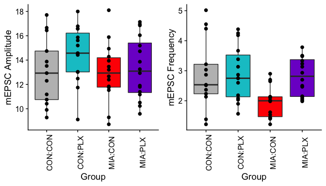
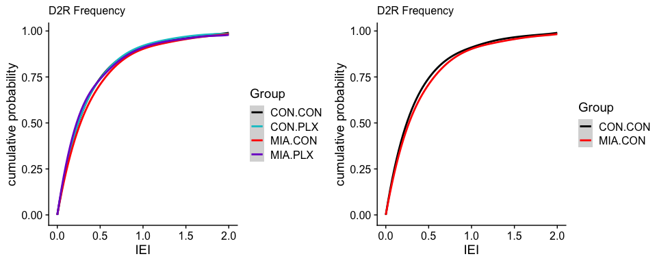

This is an rmarkdown of the ephys data from **CON:CON**, **CON:PLX**, **MIA:CON**, and **MIA:PLX** mice treated with 10 mg/kg PIC at E9 and PLX from E9-E12. Recordings were performed on D1TdTom- cells in the ventral striatum.

### Set-Up Data and Subset

```
## 'data.frame':	58 obs. of  8 variables:
##  $ File  : Factor w/ 58 levels "0302_1","0302_3",..: 20 21 22 36 37 38 39 40 41 42 ...
##  $ ID    : Factor w/ 17 levels "19-118-1","19-53-1",..: 3 3 3 6 7 7 7 8 8 8 ...
##  $ Litter: Factor w/ 12 levels "19-118","19-53",..: 3 3 3 5 5 5 5 6 6 6 ...
##  $ Group : Factor w/ 4 levels "CON:CON","CON:PLX",..: 1 1 1 1 1 1 1 1 1 1 ...
##  $ Cell  : chr  "3" "5" "6" "2" ...
##  $ Type  : Factor w/ 1 level "D2R": 1 1 1 1 1 1 1 1 1 1 ...
##  $ mFreq : num  2.23 2.13 2.52 1.38 5.02 ...
##  $ mAmp  : num  17.71 16.44 11.18 9.28 10.75 ...
```

```
##   data$Group  n
## 1    CON:CON 13
## 2    CON:PLX 15
## 3    MIA:CON 14
## 4    MIA:PLX 16
```

```
##    data$Group  data$ID n
## 1     CON:CON  19-59-2 3
## 2     CON:CON  19-64-2 1
## 3     CON:CON  19-64-4 3
## 4     CON:CON  19-65-3 3
## 5     CON:CON  19-65-4 3
## 6     CON:PLX  19-53-1 5
## 7     CON:PLX  19-61-1 4
## 8     CON:PLX  19-61-2 3
## 9     CON:PLX  20-15-1 3
## 10    MIA:CON 19-118-1 4
## 11    MIA:CON  20-39-1 2
## 12    MIA:CON  20-39-2 2
## 13    MIA:CON   M128-1 6
## 14    MIA:PLX  19-71-3 4
## 15    MIA:PLX  19-77-1 6
## 16    MIA:PLX  19-77-2 3
## 17    MIA:PLX  20-37-1 3
```

### Plot mEPSC Frequency and Amplitude
<!-- -->

### Statistics for Frequency and Amplitude

```r
library(lme4)
library(lmerTest)

data %>% group_by(Group) %>% shapiro_test(mFreq)
```

```
## # A tibble: 4 x 4
##   Group   variable statistic      p
##   <fct>   <chr>        <dbl>  <dbl>
## 1 CON:CON mFreq        0.931 0.352 
## 2 CON:PLX mFreq        0.942 0.411 
## 3 MIA:CON mFreq        0.925 0.256 
## 4 MIA:PLX mFreq        0.903 0.0904
```

```r
data %>% group_by(Group) %>% shapiro_test(mAmp)
```

```
## # A tibble: 4 x 4
##   Group   variable statistic     p
##   <fct>   <chr>        <dbl> <dbl>
## 1 CON:CON mAmp         0.948 0.575
## 2 CON:PLX mAmp         0.956 0.618
## 3 MIA:CON mAmp         0.977 0.957
## 4 MIA:PLX mAmp         0.932 0.264
```

```r
bartlett.test(data$mFreq ~ data$Group) # unequal variance
```

```
## 
## 	Bartlett test of homogeneity of variances
## 
## data:  data$mFreq by data$Group
## Bartlett's K-squared = 9.2, df = 3, p-value = 0.03
```

```r
bartlett.test(data$mAmp ~ data$Group) # equal variance
```

```
## 
## 	Bartlett test of homogeneity of variances
## 
## data:  data$mAmp by data$Group
## Bartlett's K-squared = 0.39, df = 3, p-value = 0.9
```

```r
lme.fit <- lmer(mFreq~Group+(1|ID),data=data)
summary(lme.fit)
```

```
## Linear mixed model fit by REML. t-tests use Satterthwaite's method [
## lmerModLmerTest]
## Formula: mFreq ~ Group + (1 | ID)
##    Data: data
## 
## REML criterion at convergence: 143.6
## 
## Scaled residuals: 
##    Min     1Q Median     3Q    Max 
## -2.124 -0.686 -0.112  0.541  2.628 
## 
## Random effects:
##  Groups   Name        Variance Std.Dev.
##  ID       (Intercept) 0.0679   0.261   
##  Residual             0.6394   0.800   
## Number of obs: 58, groups:  ID, 17
## 
## Fixed effects:
##              Estimate Std. Error      df t value Pr(>|t|)    
## (Intercept)    2.8602     0.2528 13.9106   11.31  2.1e-08 ***
## GroupCON:PLX   0.0765     0.3523 10.8478    0.22    0.832    
## GroupMIA:CON  -0.9481     0.3597 10.6555   -2.64    0.024 *  
## GroupMIA:PLX  -0.0483     0.3492 10.2433   -0.14    0.893    
## ---
## Signif. codes:  0 '***' 0.001 '**' 0.01 '*' 0.05 '.' 0.1 ' ' 1
## 
## Correlation of Fixed Effects:
##             (Intr) GCON:P GMIA:C
## GropCON:PLX -0.718              
## GropMIA:CON -0.703  0.504       
## GropMIA:PLX -0.724  0.520  0.509
```

```r
summary(glht(lme.fit, linfct = mcp(Group = c("CON:PLX - CON:CON == 0", "MIA:CON - CON:CON == 0", "MIA:PLX - CON:CON == 0", "MIA:PLX - MIA:CON == 0")), test = adjusted("BH")))
```

```
## 
## 	 Simultaneous Tests for General Linear Hypotheses
## 
## Multiple Comparisons of Means: User-defined Contrasts
## 
## 
## Fit: lmer(formula = mFreq ~ Group + (1 | ID), data = data)
## 
## Linear Hypotheses:
##                        Estimate Std. Error z value Pr(>|z|)  
## CON:PLX - CON:CON == 0   0.0765     0.3523    0.22    0.995  
## MIA:CON - CON:CON == 0  -0.9481     0.3597   -2.64    0.030 *
## MIA:PLX - CON:CON == 0  -0.0483     0.3492   -0.14    0.999  
## MIA:PLX - MIA:CON == 0   0.8997     0.3514    2.56    0.037 *
## ---
## Signif. codes:  0 '***' 0.001 '**' 0.01 '*' 0.05 '.' 0.1 ' ' 1
## (Adjusted p values reported -- single-step method)
```

```r
lme.fit <- lmer(mAmp~Group+(1|ID),data=data)
summary(lme.fit)
```

```
## Linear mixed model fit by REML. t-tests use Satterthwaite's method [
## lmerModLmerTest]
## Formula: mAmp ~ Group + (1 | ID)
##    Data: data
## 
## REML criterion at convergence: 260.7
## 
## Scaled residuals: 
##     Min      1Q  Median      3Q     Max 
## -1.6599 -0.5992  0.0263  0.6108  1.9203 
## 
## Random effects:
##  Groups   Name        Variance Std.Dev.
##  ID       (Intercept) 1.66     1.29    
##  Residual             5.05     2.25    
## Number of obs: 58, groups:  ID, 17
## 
## Fixed effects:
##              Estimate Std. Error      df t value Pr(>|t|)    
## (Intercept)   12.9161     0.8619 14.4803   14.99  3.2e-10 ***
## GroupCON:PLX   1.4615     1.2259 12.2207    1.19     0.26    
## GroupMIA:CON  -0.0175     1.2498 12.6283   -0.01     0.99    
## GroupMIA:PLX   0.3792     1.2200 11.9081    0.31     0.76    
## ---
## Signif. codes:  0 '***' 0.001 '**' 0.01 '*' 0.05 '.' 0.1 ' ' 1
## 
## Correlation of Fixed Effects:
##             (Intr) GCON:P GMIA:C
## GropCON:PLX -0.703              
## GropMIA:CON -0.690  0.485       
## GropMIA:PLX -0.706  0.497  0.487
```

```r
summary(glht(lme.fit, linfct = mcp(Group = c("CON:PLX - CON:CON == 0", "MIA:CON - CON:CON == 0", "MIA:PLX - CON:CON == 0", "MIA:PLX - MIA:CON == 0")), test = adjusted("BH")))
```

```
## 
## 	 Simultaneous Tests for General Linear Hypotheses
## 
## Multiple Comparisons of Means: User-defined Contrasts
## 
## 
## Fit: lmer(formula = mAmp ~ Group + (1 | ID), data = data)
## 
## Linear Hypotheses:
##                        Estimate Std. Error z value Pr(>|z|)
## CON:PLX - CON:CON == 0   1.4615     1.2259    1.19     0.56
## MIA:CON - CON:CON == 0  -0.0175     1.2498   -0.01     1.00
## MIA:PLX - CON:CON == 0   0.3792     1.2200    0.31     0.98
## MIA:PLX - MIA:CON == 0   0.3967     1.2509    0.32     0.98
## (Adjusted p values reported -- single-step method)
```

### Statistics for cumulative probability for mEPSC Frequency

```r
setwd("~/Data/Ephys/Ephys/210905_Analysis")
cumlFreq <- read.csv("210816_rescue_mEPSC_cumprob.csv", stringsAsFactors = T)
cumlFreq_v1 <- filter(cumlFreq, Group %in% c("CON.CON", "MIA.CON"))

cumlFreq<- filter(cumlFreq, IEI <= 4)
a=ggplot(cumlFreq, aes(x=IEI, y=probability, group=Group, color=Group)) + scale_color_manual(values=c("black","turquoise3", "red", "purple3")) + geom_smooth(method = lm, formula = y ~ splines::bs(x, 10)) + labs(y="cumulative probability", subtitle="D2R Frequency") + xlim(0,2) + theme_cowplot()

b=ggplot(cumlFreq_v1, aes(x=IEI, y=probability, group=Group, color=Group)) + scale_color_manual(values=c("black", "red")) + geom_smooth(method = lm, formula = y ~ splines::bs(x, 10)) + labs(y="cumulative probability", subtitle="D2R Frequency")  + xlim(0,2) + theme_cowplot()
plot_grid(a,b)
```

<!-- -->

```r
ks.test(cumlFreq[cumlFreq$Group=="CON.CON",]$probability,cumlFreq[cumlFreq$Group=="CON.PLX",]$probability)
```

```
## 
## 	Two-sample Kolmogorov-Smirnov test
## 
## data:  cumlFreq[cumlFreq$Group == "CON.CON", ]$probability and cumlFreq[cumlFreq$Group == "CON.PLX", ]$probability
## D = 0.12, p-value = 0.9
## alternative hypothesis: two-sided
```

```r
ks.test(cumlFreq[cumlFreq$Group=="CON.CON",]$probability,cumlFreq[cumlFreq$Group=="MIA.CON",]$probability)
```

```
## 
## 	Two-sample Kolmogorov-Smirnov test
## 
## data:  cumlFreq[cumlFreq$Group == "CON.CON", ]$probability and cumlFreq[cumlFreq$Group == "MIA.CON", ]$probability
## D = 0.32, p-value = 0.03
## alternative hypothesis: two-sided
```

```r
ks.test(cumlFreq[cumlFreq$Group=="CON.CON",]$probability,cumlFreq[cumlFreq$Group=="MIA.PLX",]$probability)
```

```
## 
## 	Two-sample Kolmogorov-Smirnov test
## 
## data:  cumlFreq[cumlFreq$Group == "CON.CON", ]$probability and cumlFreq[cumlFreq$Group == "MIA.PLX", ]$probability
## D = 0.15, p-value = 0.8
## alternative hypothesis: two-sided
```


```r
sessionInfo()
```

```
## R version 4.0.3 (2020-10-10)
## Platform: x86_64-apple-darwin17.0 (64-bit)
## Running under: macOS Big Sur 10.16
## 
## Matrix products: default
## BLAS:   /Library/Frameworks/R.framework/Versions/4.0/Resources/lib/libRblas.dylib
## LAPACK: /Library/Frameworks/R.framework/Versions/4.0/Resources/lib/libRlapack.dylib
## 
## locale:
## [1] en_US.UTF-8/en_US.UTF-8/en_US.UTF-8/C/en_US.UTF-8/en_US.UTF-8
## 
## attached base packages:
## [1] stats     graphics  grDevices utils     datasets  methods   base     
## 
## other attached packages:
##  [1] lmerTest_3.1-3  lme4_1.1-27.1   Matrix_1.3-4    multcomp_1.4-17
##  [5] TH.data_1.0-10  MASS_7.3-54     survival_3.2-11 mvtnorm_1.1-2  
##  [9] rstatix_0.7.0   cowplot_1.1.1   forcats_0.5.1   stringr_1.4.0  
## [13] dplyr_1.0.7     purrr_0.3.4     readr_1.4.0     tidyr_1.1.3    
## [17] tibble_3.1.2    ggplot2_3.3.5   tidyverse_1.3.1
## 
## loaded via a namespace (and not attached):
##  [1] nlme_3.1-152        fs_1.5.0            lubridate_1.7.10   
##  [4] httr_1.4.2          numDeriv_2016.8-1.1 tools_4.0.3        
##  [7] backports_1.2.1     bslib_0.2.5.1       utf8_1.2.1         
## [10] R6_2.5.0            mgcv_1.8-36         DBI_1.1.1          
## [13] colorspace_2.0-2    withr_2.4.2         tidyselect_1.1.1   
## [16] curl_4.3.2          compiler_4.0.3      cli_3.0.0          
## [19] rvest_1.0.0         xml2_1.3.2          sandwich_3.0-1     
## [22] labeling_0.4.2      sass_0.4.0          scales_1.1.1       
## [25] digest_0.6.27       foreign_0.8-81      minqa_1.2.4        
## [28] rmarkdown_2.9       rio_0.5.27          pkgconfig_2.0.3    
## [31] htmltools_0.5.1.1   dbplyr_2.1.1        highr_0.9          
## [34] rlang_0.4.11        readxl_1.3.1        rstudioapi_0.13    
## [37] jquerylib_0.1.4     generics_0.1.0      farver_2.1.0       
## [40] zoo_1.8-9           jsonlite_1.7.2      zip_2.2.0          
## [43] car_3.0-11          magrittr_2.0.1      Rcpp_1.0.7         
## [46] munsell_0.5.0       fansi_0.5.0         abind_1.4-5        
## [49] lifecycle_1.0.0     stringi_1.6.2       yaml_2.2.1         
## [52] carData_3.0-4       grid_4.0.3          crayon_1.4.1       
## [55] lattice_0.20-44     haven_2.4.1         splines_4.0.3      
## [58] hms_1.1.0           knitr_1.33          pillar_1.6.1       
## [61] boot_1.3-28         codetools_0.2-18    reprex_2.0.0       
## [64] glue_1.4.2          evaluate_0.14       data.table_1.14.0  
## [67] modelr_0.1.8        vctrs_0.3.8         nloptr_1.2.2.2     
## [70] cellranger_1.1.0    gtable_0.3.0        assertthat_0.2.1   
## [73] xfun_0.24           openxlsx_4.2.4      broom_0.7.8        
## [76] ellipsis_0.3.2
```
